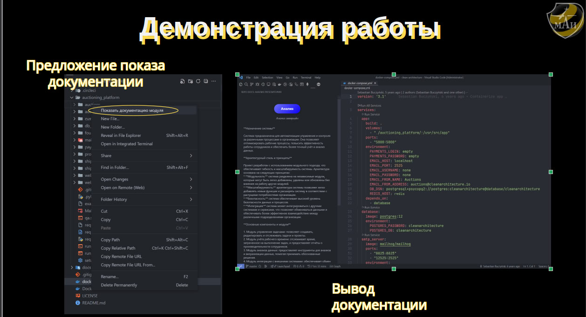

# Beeline Case

A Python-based project for repository documentation generation and analysis.

## Project Overview

This project provides tools for generating and analyzing repository documentation, with features for visualization, parsing, and data ingestion. It includes a FastAPI-based API and various utilities for working with repository data.

## Features

- Repository documentation generation
- Visualization tools for repository analysis
- FastAPI-based REST API
- Docker containerization support
- Integration with Yandex Cloud ML SDK
- Graph visualization capabilities using NetworkX and Plotly

## Prerequisites

- Python 3.12.7
- Poetry for dependency management
- Docker and Docker Compose (optional)

## Installation

1. Clone the repository:
```bash
git clone <repository-url>
cd beeline
```

2. Install dependencies using Poetry:
```bash
poetry install
```

## Project Structure

- `api.py` - FastAPI application
- `visualization/` - Visualization tools and utilities
- `parsers/` - Data parsing modules
- `ingest/` - Data ingestion components
- `llm/` - Language model related functionality
- `Dockerfile` - Container configuration
- `docker-compose.yaml` - Docker Compose configuration

## Usage

### Running the API

```bash
poetry run uvicorn api:app --reload
```

### Using Docker

```bash
docker-compose up
```

## Dependencies

- FastAPI
- Streamlit
- NetworkX
- Plotly
- PyVis
- Graphviz
- Yandex Cloud ML SDK
- PyGit2
- AsyncPG

